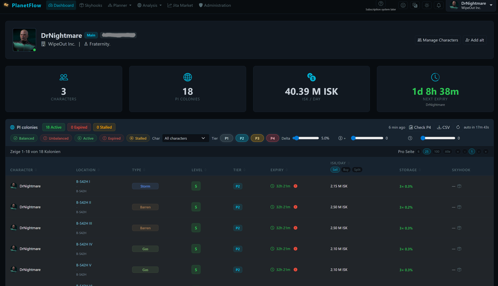
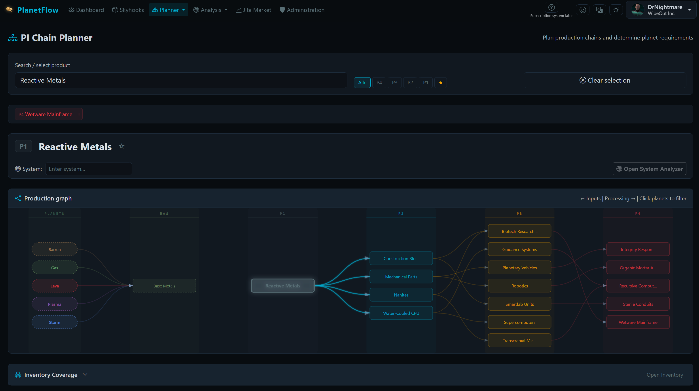
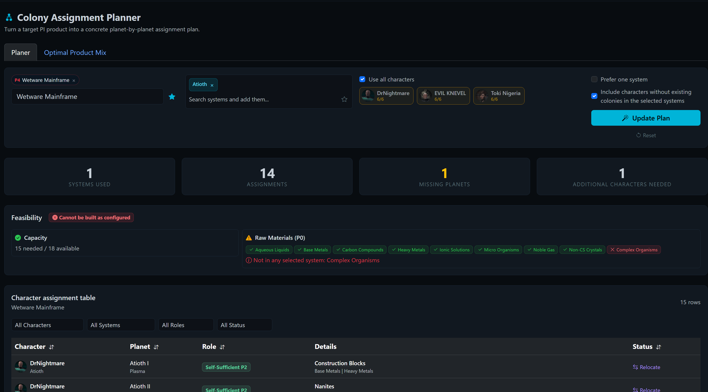
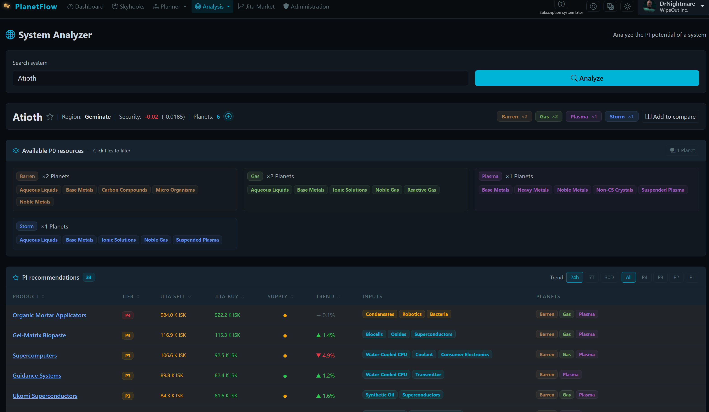
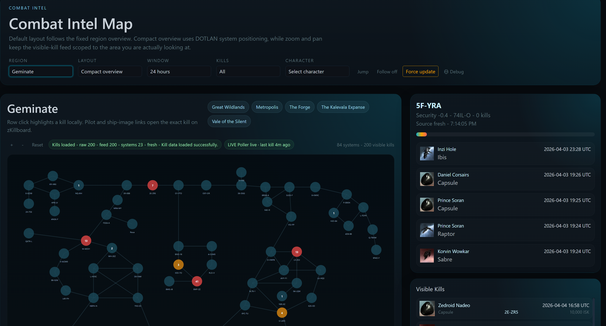

# PlanetFlow

[Deutsch](README.de.md) | [English](README.en.md) | [ZH-CN](README.zh-Hans.md)

Self-hosted Planetary Industry platform for EVE Online with page-based access control, billing, planning tools, background refresh workers, and production-ready Docker deployment.

If the project is useful to you, in-game ISK donations to `DrNightmare` are welcome.

## Highlights

- PI dashboard plus inventory, hauling, intel, killboard, skyhooks, and templates
- Billing and access management pages built into the app
- Planner, colony assignment, system analysis, market, and corporation workflows
- FastAPI + PostgreSQL + Celery + RabbitMQ deployment with nginx and certbot
- German, English, and Simplified Chinese UI translations

## Screenshots











## Quick Start

```bash
cp .env.example .env
docker compose up -d
```

Required `.env` values:

- `DB_PASSWORD`
- `EVE_CLIENT_ID`
- `EVE_CLIENT_SECRET`
- `EVE_CALLBACK_URL`
- `SECRET_KEY`
- `RABBITMQ_PASS`

## Included Scripts

| Script | Purpose |
|---|---|
| `scripts/setup_hetzner.sh` | Prepare a fresh Hetzner Ubuntu server |
| `scripts/start.sh` | Validate `.env`, obtain TLS certs, and start the stack |
| `scripts/update.sh` | Pull, rebuild, restart, and run migrations |
| `scripts/add_administrator.py` | Grant administrator access |
| `scripts/remove_administrator.py` | Remove administrator access |

## Full Documentation

- [Deutsch](README.de.md)
- [English](README.en.md)
- [ZH-CN](README.zh-Hans.md)

## License

MIT. See [LICENSE](LICENSE).
